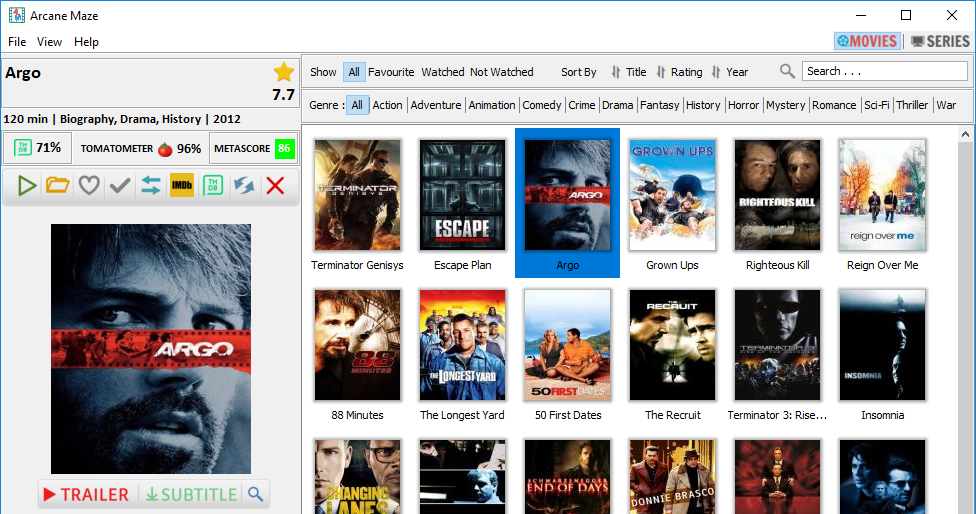

# Arcane Maze 
> Application to organize your movies and series collection.

## Features in v2.0
- Auto recognize movie and episode file.
- Imdb Rating, Tmdb Rating, Tomatometer and Merascore support for movies.
- Imdb Rating and Tmdb Rating support for series/episodes.
- Search movies/series by Title, Actors, Directors.
- Sort movies/series by Title, Rating and Year.
- Mark movies/series/episode as favourite, watched
- Filter movies/series/episodes based on favourite and watched/not watched.
- Filter movies/series based on Actors, Directors and Genre.
- View trailer for movies.
- Download/search subtitles for movies and episodes.
- Easy to use , simple UI

## Release date
- Arcae Maze v2.0-bata is now available

## Download

[Click here](http://arcanemaze.com) to download the application for windows. (v2.0)

## Install Instruction 
- Arcane Maze is currently available for Windows
- JRE 1.8 is required.

Arcane Maze comes as self extract exe file for windows.
Install it as any other windows application.

## Snapshot

 
